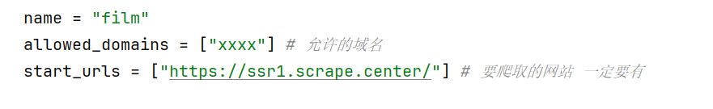

# scrapy流程

##### 1、 创建命令

scrapy startproject 项目名

##### 2、 创建爬虫文件

cd 项目mulu 
scrapy genspider 爬虫名 xxx 允许的域名

##### 3、 执行爬虫命令

scrapy crawal 爬虫名

##### 4、在爬虫文件解析数据

- 
- 直接用response进行xpath解析 
- 用getall()获取Selector解析出来的数据并返回给管道
- 定义并引入itmes，在items.py文件定义字段并在爬虫文件导入
- from 项目名.items import 模型类
  item = 模型类()
  item["字段名"] = 值
  yield 返回item给管道

##### 5、在settings文件关闭robot协议
ROBOTSTXT_OBEY = False

##### 6、管道接收到item（这里要注意在settings文件接触管道的注释）
- 在这里可以通过pymysql直接存储到数据库
- mysql的配置写到settings文件中并导入到管道文件piplines.py 
- 导入 pymysql 、在管道类定义爬虫启动方法,连接数据库
  **def open_spider(self,spider):**
      **print("爬虫启动")**
      **self.conn = pymysql.connect(mysql_local)**
      **self.cur = self.conn.cursor()**
- 在process_item方法中直接插入数据库
  **def process_item(self, item, spider)**:
      **dataList = item["dataList"]**
      **sql = "INSERT INTO films(fileName,score,areas) VALUES (%s,%s,%s);"**
      **self.cur.executemany(sql, dataList)**
      **self.conn.commit()**
      **return item**
          